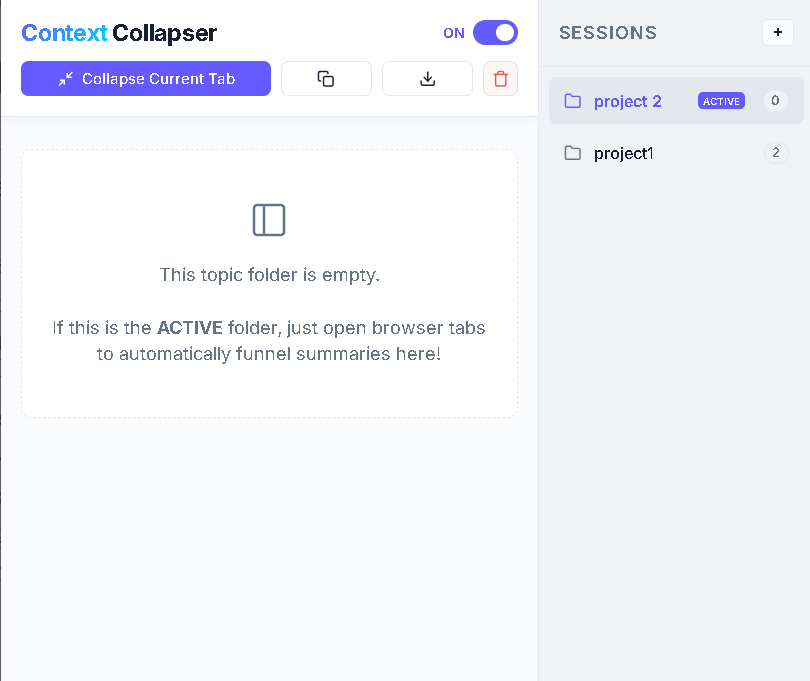

<!-- TODO: Replace the path below with the path to your header image/logo -->

# Context Collapser

**Context Collapser** is a powerful, AI-driven Chrome Extension designed to 10X your research productivity. It automatically manages your browser tab clutter by collapsing excess tabs into highly concise, intelligent summaries stored across virtual research folders. 

Never lose track of a crucial webpage again. Keep your computer's RAM usage low, and your research impeccably organized.

---

## ⚡ Key Features

* **Automated Tab Clutter Management:** Context Collapser actively monitors your browser. If you open more than 3 tabs, it utilizes an intelligent background queue to automatically target the oldest tab, read its content, and close it.
* **AI-Powered Summarization:** Driven by Google's **Gemini 3 Flash** AI, every closed tab is instantly processed into a rapid 2–3 sentence summary highlighting only the core concepts of the page.
* **Virtual Topic Folders:** Segregate your research flawlessly. Create custom "Sessions" (e.g., "Physics Project," "AI Engineering") right in the extension popup. New tabs will automatically funnel their summaries directly into the active folder.
* **Master Power Toggle:** Take full control. The extension is `OFF` by default. Switch it `ON` only when you are deep in a research session. Enable it retroactively, and it will instantly crunch your existing open tabs into a clean queue.
* **"Collapse Current Tab" Mode:** Need a quick summary right now? Hit the manual collapse button to instantly snipe the exact webpage you are viewing and log the summary straight to your active session.
* **One-Click Export:** Instantly copy your entire compiled research session to your clipboard, or download it securely as a timestamped `.txt` file for your notes.

---

## 📸 Interface

<!-- TODO: Replace the path below with a screenshot of the Context Collapser popup doing its work -->

---

## 🛠️ How to Use (Bring Your Own Key)

To protect your privacy and ensure you never have to pay a subscription fee, Context Collapser operates on a **"Bring Your Own Key" (BYOK)** architecture. You use your own free Google API key to power the AI!

### Setup Instructions
1. Download the extension from the Chrome Web Store.
2. Go to [Google AI Studio](https://aistudio.google.com/) and generate a **free API key** for the Gemini API.
3. Open the **Extensions Menu** in Chrome (the puzzle piece icon), and pin Context Collapser to your taskbar.
4. Right-click the Context Collapser icon and click **"Options"**.
5. Paste your Gemini API key strictly into this menu and hit **Save**. *(Your key is securely stored in Chrome's encrypted local memory and never leaves your machine).*

### Workflow
1. Click the Context Collapser icon to open the interface.
2. Click the **"+"** button on the right panel to name your Virtual Research Folder.
3. Flip the **Master Power Toggle** to **`ON`**.
4. Browse the web normally! As you exceed 3 tabs, the AI will silently summarize the oldest tabs and log them into your elected folder.
5. Hit **Download** when you're done researching!

